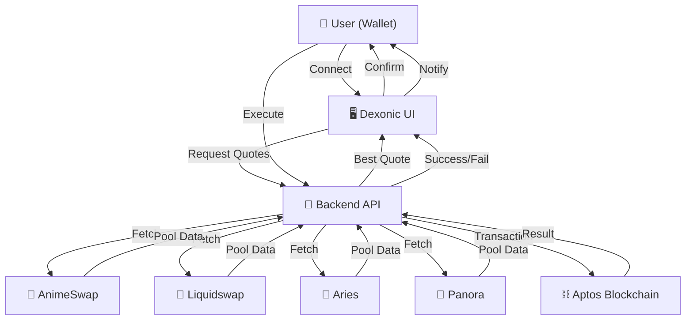

# 🚀 Dexonic DEX Aggregator

[](https://nextjs.org/)
[](https://www.typescriptlang.org/)
[](https://aptos.dev/)
[](LICENSE)

> **Tổng hợp thanh khoản và tối ưu giá swap trên blockchain Aptos**

Dexonic DEX Aggregator là nền tảng tổng hợp thanh khoản thông minh, giúp người dùng tìm kiếm và thực hiện giao dịch swap với giá tốt nhất trên hệ sinh thái Aptos. Hệ thống tự động so sánh giá, phí, và trượt giá từ nhiều DEX để đảm bảo người dùng luôn nhận được deal tốt nhất.

## ✨ Tính Năng Nổi Bật

### 🔄 Swap Tối Ưu

- **So sánh giá real-time** từ 4 DEX lớn nhất trên Aptos
- **Tự động chọn route tốt nhất** dựa trên giá, phí, và trượt giá
- **Swap 1-click** với DEX có nhãn "Best"
- **Hỗ trợ Cross-Address Swap** - gửi token đến địa chỉ khác

### 🏦 Tích Hợp DEX

- **AnimeSwap** - Fee: 0.25%
- **Liquidswap** - Fee: 0.30%
- **Aries** - Fee: 0.20%
- **Panora** - Fee: 0.18% (thấp nhất)

### 💰 Giao Diện Thông Minh

- **Bảng so sánh trực quan** với nhãn Best/Unstable Pool
- **Thông báo chi tiết** swap success/failure
- **Toast notifications** và popup thông tin giao dịch
- **Responsive design** cho mobile và desktop
- **Dark theme** hiện đại

### 🔐 Bảo Mật & UX

- **Multi-wallet support** (Petra, Pontem)
- **Không lưu private key** - an toàn tuyệt đối
- **Error handling** robust với fallback logic
- **Real-time balance** display

## 🛠️ Cài Đặt & Chạy

### Yêu Cầu Hệ Thống

- Node.js 18+
- pnpm (khuyến nghị) hoặc npm
- Git

### Bước 1: Clone Repository

```bash
git clone https://github.com/your-username/DexonicDexAggregator.git
cd DexonicDexAggregator
```

### Bước 2: Cài Đặt Dependencies

```bash
pnpm install
```

### Bước 3: Chạy Development Server

```bash
pnpm dev
```

### Bước 4: Truy Cập Ứng Dụng

- **Main page**: http://localhost:3000
- **Swap interface**: http://localhost:3000/swap
- **Profile**: http://localhost:3000/profile
- **Chat**: http://localhost:3000/chat

## 📖 Hướng Dẫn Sử Dụng

### 1. Kết Nối Ví

- Cài đặt ví Petra hoặc Pontem
- Click "Connect Wallet" trên giao diện
- Chấp nhận kết nối từ ví

### 2. Chọn Token & Số Lượng

- Chọn token muốn swap (APT, USDC, USDT...)
- Nhập số lượng cần swap
- Hệ thống tự động hiển thị số lượng nhận được

### 3. So Sánh & Swap

- Xem bảng so sánh giá từ các DEX
- DEX có nhãn "Best" sẽ được chọn tự động
- Click "Swap" để thực hiện giao dịch

### 4. Xác Nhận & Hoàn Tất

- Xem lại thông tin giao dịch
- Xác nhận trên ví
- Nhận thông báo kết quả

## 🏗️ Kiến Trúc Hệ Thống



## 🛠️ Công Nghệ Sử Dụng

### Frontend

- **Next.js 15.2.4** - React framework
- **TypeScript** - Type safety
- **Tailwind CSS** - Styling
- **Radix UI** - Component library
- **Sonner** - Toast notifications
- **Lucide React** - Icons

### Backend & Blockchain

- **Aptos SDK** - Blockchain interaction
- **AnimeSwap SDK** - DEX integration
- **Liquidswap SDK** - DEX integration
- **Aries SDK** - DEX integration
- **Thala Router SDK** - Routing

### Development Tools

- **pnpm** - Package manager
- **ESLint** - Code linting
- **PostCSS** - CSS processing
- **Autoprefixer** - CSS compatibility

## 📁 Cấu Trúc Project

```
DexonicDexAggregator/
├── app/                    # Next.js app directory
│   ├── api/               # API routes
│   ├── swap/              # Swap interface
│   ├── profile/           # User profile
│   └── chat/              # Chat feature
├── components/            # React components
│   ├── ui/               # Base UI components
│   ├── swap/             # Swap-specific components
│   ├── wallet/           # Wallet integration
│   └── auth/             # Authentication
├── lib/                  # Utility functions
├── hooks/                # Custom React hooks
├── public/               # Static assets
└── styles/               # Global styles
```

## 🔧 API Endpoints

### Simulate Swap

```http
POST /api/simulate-swap
Content-Type: application/json

{
  "fromToken": "0x1::aptos_coin::AptosCoin",
  "toToken": "0xf22bede237a07e121b56d91a491eb7bcdfd1f5907926a9e58338f964a01b17fa::asset::USDC",
  "amount": "10"
}
```

### Response Example

```json
{
  "quotes": [
    {
      "dex": "Panora",
      "outputAmount": "5.161200",
      "fee": "0.18",
      "priceImpact": "0.12",
      "route": ["Panora"]
    },
    {
      "dex": "Aries",
      "outputAmount": "5.159660",
      "fee": "0.20",
      "priceImpact": "0.15",
      "route": ["Aries"]
    }
  ]
}
```

## 🚀 Deployment

### Vercel (Khuyến Nghị)

```bash
# Install Vercel CLI
npm i -g vercel

# Deploy
vercel
```

### Manual Deployment

```bash
# Build production
pnpm build

# Start production server
pnpm start
```

## 🤝 Đóng Góp

Chúng tôi rất hoan nghênh mọi đóng góp! Hãy:

1. Fork project
2. Tạo feature branch (`git checkout -b feature/AmazingFeature`)
3. Commit changes (`git commit -m 'Add some AmazingFeature'`)
4. Push to branch (`git push origin feature/AmazingFeature`)
5. Tạo Pull Request

## 📄 License

Dự án này được phân phối dưới giấy phép MIT. Xem file `LICENSE` để biết thêm chi tiết.

## 📞 Liên Hệ

- **GitHub**: [DexonicDexAggregator](https://github.com/your-username/DexonicDexAggregator)
- **Email**: your-email@example.com
- **Discord**: [Dexonic Community](https://discord.gg/dexonic)

## 🙏 Cảm Ơn

Cảm ơn tất cả các DEX đã cung cấp API và SDK:

- [AnimeSwap](https://animeswap.org/)
- [Liquidswap](https://liquidswap.com/)
- [Aries](https://aries.markets/)
- [Panora](https://panora.finance/)

---

**⭐ Nếu dự án này hữu ích, hãy cho chúng tôi một star! ⭐**
