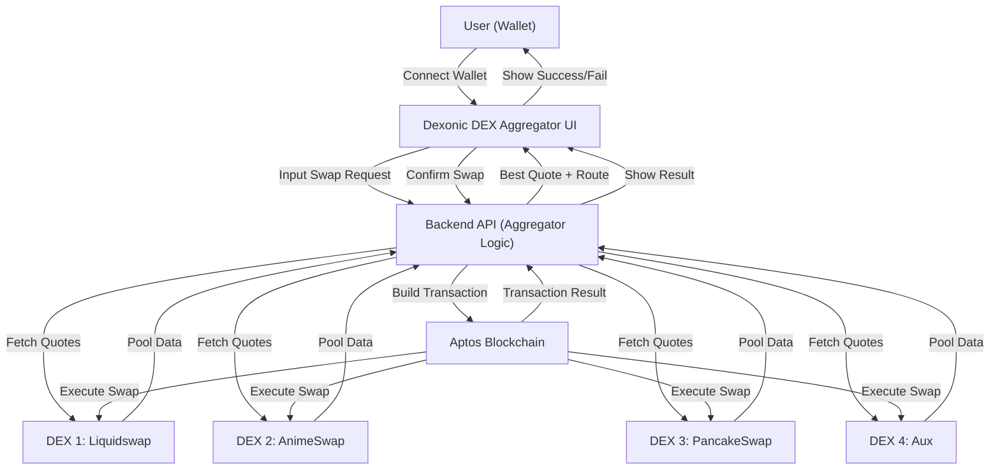

# Dexonic DEX Aggregator - Hướng Dẫn & Sơ Đồ Hoạt Động

## Tổng Quan Dự Án

Dexonic DEX Aggregator là nền tảng tổng hợp thanh khoản và tối ưu giá swap trên blockchain Aptos. Người dùng chỉ cần kết nối ví, chọn cặp token và số lượng, hệ thống sẽ tự động so sánh giá, phí, trượt giá trên nhiều DEX (như Liquidswap, AnimeSwap, PancakeSwap, Aux...) và thực hiện giao dịch với route tốt nhất.

## Tính Năng Chính

- **So sánh giá & phí swap trên nhiều DEX:** Tự động lấy báo giá từ nhiều sàn, chọn route tối ưu nhất.
- **Swap 1-click với DEX tốt nhất:** Nút Swap luôn thực hiện với sàn có nhãn Best.
- **Hỗ trợ Cross-Address Swap:** Gửi token nhận được đến địa chỉ khác nếu DEX hỗ trợ.
- **Thông báo swap chi tiết:** Hiển thị popup/toast/card với thông tin Txn, phí, số lượng token swap/nhận.
- **Bảng so sánh DEX trực quan:** Gắn nhãn Best, Unstable Pool, tự động mở rộng cột khi có nhiều nhãn.
- **Tích hợp nhiều DEX lớn trên Aptos:** Liquidswap, AnimeSwap, PancakeSwap, Aux, SushiSwap...
- **Bảo mật & tối ưu UX:** Kết nối ví an toàn, không lưu private key, giao diện hiện đại.

## Sơ Đồ Hoạt Động Tổng Quan

## Quy Trình Hoạt Động

1. **Người dùng kết nối ví** (Petra, Pontem...)
2. **Nhập cặp token, số lượng cần swap**
3. **UI gửi yêu cầu lên backend aggregator**
4. **Backend lấy báo giá từ nhiều DEX** (gọi API/pool từng sàn)
5. **So sánh, chọn route tốt nhất** (giá, phí, trượt giá...)
6. **UI hiển thị bảng so sánh, gắn nhãn Best/Unstable Pool**
7. **Người dùng bấm Swap, hệ thống gửi giao dịch với DEX tốt nhất**
8. **Backend build transaction, gửi lên blockchain Aptos**
9. **Aptos thực thi swap trên DEX tương ứng**
10. **Kết quả trả về UI, hiển thị thông báo chi tiết cho người dùng**

---

**Dexonic DEX Aggregator** giúp người dùng swap token tối ưu, minh bạch, an toàn và trải nghiệm tốt nhất trên hệ sinh thái Aptos.
